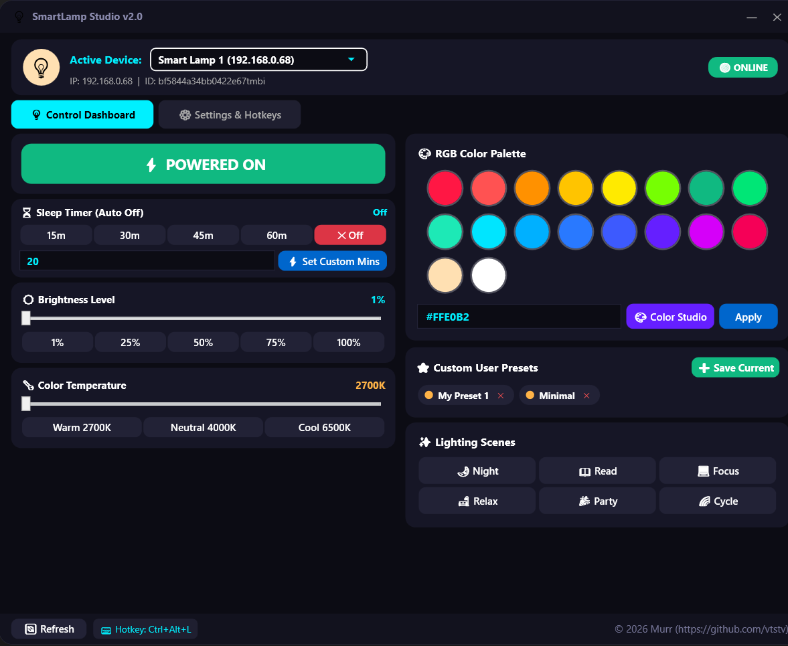

# 💡 SmartLamp Studio
Desktop Application for controlling Tuya smart lamps with **Google Smart Home / Google Assistant Integration**, **MQTT Bridge** and **Wi-Fi Auto-Discovery**.

[]()
[]()
[]()
[](LICENSE)

---



---

## ✨ Features & Architecture

- **⚡ High Performance Tuya 3.5 Protocol Engine:**
  - Uses an internal daemon HTTP server for persistent TCP socket connections to Tuya devices, dropping latency to **~10ms** and eliminating dropped commands.
  - Bundled as a single embedded executable resource inside `SmartLampApp.exe`.
- **🚀 System Installation & Windows Autostart:**
  - **1-Click System Installation:** Installs app to `%LocalAppData%\SmartLampStudio`, registers in Windows Start Menu & **Installed Apps (Settings -> Apps)**.
  - **Windows Autostart:** Optionally launch at Windows boot directly into System Tray.
- **💻 Headless CLI Mode & Desktop Shortcut:**
  - Control your smart lamp silently via Command Line without opening the GUI!
  - Generate a 1-click **Desktop Shortcut (`Toggle Smart Lamp.lnk`)** directly from the UI to toggle power on double click.
- **🌐 Google Smart Home & Assistant Integration:**
  - Includes a built-in **Google Smart Home Local Bridge HTTP/Webhook Server** (`http://localhost:8088/google-smart-home/`) supporting Google Smart Home intents (`SYNC`, `QUERY`, `EXECUTE`).
  - Includes a **Google Assistant Voice Command Simulator** directly inside the app!
- **📡 Home Assistant & MQTT Bridge:**
  - Built-in MQTT bridge (`port 1883`) for easy integration with Home Assistant.
- **🔍 Wi-Fi Auto-Discovery & Multi-Device Selector:**
  - Subnet UDP Broadcast Scanner to auto-discover Tuya devices on Wi-Fi.
  - Multi-device switcher & Group Control.
- **🎨 Modern Glassmorphic UI & Interactive Color Picker:**
  - Ambient Light Indicator, zero scrollbars, custom title bar, and 18-color RGB palette.
- **🔒 DPAPI Secret Encryption:**
  - Automatically encrypts sensitive credentials using Windows Data Protection API (DPAPI).

---

## 💻 CLI Commands & System Installation

You can trigger headless commands or installation directly via `SmartLampApp.exe` (or via UI buttons):

| Command | Description |
| :--- | :--- |
| `SmartLampApp.exe --install` | Installs app into `%LocalAppData%`, registers Start Menu & Uninstall entry |
| `SmartLampApp.exe --uninstall` | Cleanly removes all shortcuts, autostart, and system registration entries |
| `SmartLampApp.exe --autostart` | Launched automatically at Windows boot (runs minimized in tray) |
| `SmartLampApp.exe --toggle` | Smartly toggles lamp power (ON if OFF, OFF if ON) based on live status |
| `SmartLampApp.exe --on` | Turns the lamp ON |
| `SmartLampApp.exe --off` | Turns the lamp OFF |
| `SmartLampApp.exe --brightness 75` | Sets brightness level (1-100%) |
| `SmartLampApp.exe --temp 4000` | Sets color temperature (2700K - 6500K) |
| `SmartLampApp.exe --color #FF5252` | Sets RGB color hex |

---

## 🛠️ Building from Source

```cmd
build.bat
```
*(Requires .NET 9 SDK)*.

---

## 📄 License

Licensed under the [MIT License](LICENSE).

Copyright (c) 2026 **[Murr](https://github.com/vtstv)**.
